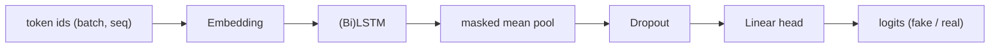

# Fake News Detection - Project Documentation

Course: *Introduction to Deep Learning, Summer Semester 2025-2026*
Topic: **Разпознаване на фалшиви новини** (Fake News Detection)

---

## 1. The idea of the project

Misinformation spreads faster than fact-checking can keep up. The goal of this
project is a model that, given the text of a news article (title + body),
decides whether it is **fake** (`0`) or **real** (`1`).

We treat it as a **binary text-classification** problem and tell the full
modelling story required by the course:

1. **Baseline** - the greediest statistical model (predict the most frequent
   class). Every later model is measured against it.
2. **Main model** - an LSTM classifier built in PyTorch.
3. **Improvements** - we list candidate ideas as bullet points and implement the
   **two simplest** ones, recording each as a new row in the report.
4. **Stretch** - a fine-tuned DistilBERT transformer.

Each trained model becomes one row of the Excel **Model Report File**, which
shows the value of every metric together with its percentage change versus the
baseline.

## 2. The data

- **Dataset**: [ISOT Fake and Real News](https://www.kaggle.com/datasets/clmentbisaillon/fake-and-real-news-dataset)
  (`Fake.csv` ~23.5k articles, `True.csv` ~21.4k articles; English, binary).
- **Fields used**: `title` and `text`, concatenated into a single document.
- **Splits**: stratified **train / validation / test** (70 / 15 / 15) with a
  fixed seed so results are reproducible.
- **Source leakage**: the real (Reuters) articles almost always begin with a
  dateline such as `WASHINGTON (Reuters) -`. A model can cheat by detecting that
  token, so `strip_source_leakage` removes it; the model must then learn from the
  actual language. This is discussed in the report's error analysis.
- **Runs out of the box**: when the CSVs are absent, the pipeline generates a
  small, separable **synthetic** corpus so the code, report and tests all run
  without the download.


## 3. Algorithms and technologies

| Concern            | Choice                                                        |
| ------------------ | ------------------------------------------------------------- |
| Language           | Python 3.12                                                   |
| Deep learning      | PyTorch (`nn.Embedding`, `nn.LSTM`, `nn.Linear`)              |
| Baseline           | Majority-class predictor                                      |
| Main model         | LSTM with masked mean-pooling over real tokens                |
| Improvement 1      | Dropout regularisation                                        |
| Improvement 2      | Bidirectional LSTM (BiLSTM)                                    |
| Stretch model      | DistilBERT fine-tuning (HuggingFace `transformers`)           |
| Optimiser / loss   | Adam / cross-entropy                                          |
| Metrics            | Accuracy, F1 (main), Recall                                   |
| Reporting          | `openpyxl` (Excel), `matplotlib` (figures)                    |
| Testing            | `unittest` + `pytest` + `coverage` (BDD, 100% coverage)       |

**Why an LSTM as the main model?** It is the sequence model the course builds up
to (Week 08) and its parameter set maps cleanly onto the report's hyperparameter
columns. Because articles are short and right-padded, the model **mean-pools the
LSTM outputs over the non-padding positions** instead of reading the final
(padded) time step - otherwise it cannot learn.



## 4. Code structure

```
deep_learning_project/
  run.py                       entry point -> src.fake_news.main.run
  requirements.txt
  src/fake_news/
    config.py                  dataclass hyperparameters
    main.py                    end-to-end pipeline orchestration
    data/
      preprocessing.py         clean_text, leakage strip, tokenize, Vocabulary
      dataset.py               ISOT loader, synthetic data, splits, Dataset
    models/
      baseline.py              MajorityClassClassifier
      lstm_classifier.py       LSTMClassifier (covers dropout + BiLSTM)
      transformer_classifier.py DistilBERT fine-tuning (optional stretch)
    training/
      metrics.py               accuracy / precision / recall / f1 / confusion
      trainer.py               train-val loop, early stopping, history
    reporting/
      report_card.py           coloured Excel Model Report File
      plots.py                 matplotlib figures
      ledger.py                JSON-lines persistence for experiment rows
  experiments/                 exp_01..exp_05 runnable scripts
  tests/                       BDD unit tests (one module per class)
  reports/                     model_report.xlsx + figures/
  docs/documentation.md        this file
```

Data flows from raw text, through cleaning and vocabulary encoding, into the
models; the trainer produces metrics and a training history, and the reporting
layer turns those into the Excel report and the figures.

## 5. The Model Report File

`reports/model_report.xlsx` follows the course's report rules:

- one row per experiment, in creation order (never re-sorted);
- hyperparameter columns first, then **Accuracy / F1 / Recall**, each showing the
  value and the percentage change versus the baseline, then a `Comments` column;
- the first row is the baseline; a highlighted cell names the **best model** and
  why; the best row and best metric cells are coloured/bold so the winner is
  obvious at a glance;
- a `Diagrams` sheet with the train-vs-validation F1 and loss curves;
- a `Best Model Examples` sheet with correct and incorrect predictions.

### Report summary

The baseline scores F1 ≈ 0.67 (it always predicts one class). The LSTM main
model and both improvements learn the language signal and lift Accuracy and F1
above the baseline, with the best model highlighted automatically in the
workbook. On the real ISOT data the BiLSTM and DistilBERT rows are expected to
edge out the plain LSTM; on the bundled synthetic corpus the task is fully
separable, so the LSTM family reaches the ceiling.

## 6. Graphics

| Figure | File |
| ------ | ---- |
| Train vs validation F1 | `reports/figures/train_val_f1.png` |
| Train vs validation loss | `reports/figures/train_val_loss.png` |
| Confusion matrix (best model) | `reports/figures/confusion_matrix.png` |
| Class distribution | `reports/figures/class_distribution.png` |
| Article length histogram | `reports/figures/text_lengths.png` |


## 7. Testing approach

Behaviour-driven development with the naming convention
`test_when_<condition>_then_<expectation>`: one test module per source class and
one test class per method/function. The suite covers preprocessing, splitting,
the baseline, the LSTM, the trainer, the metrics, the report card, the ledger,
the plots and the end-to-end pipeline, reaching **100% statement coverage** of
the `src` package.

```bash
coverage run -m pytest
coverage report -m
```

## 8. Limitations and future work

- **English only** - no Bulgarian or multilingual coverage.
- **Source-style leakage** - ISOT's Reuters datelines make the raw task easier
  than real-world detection; we strip them, but stylistic artefacts remain.
- **No external knowledge** - the model judges language only; it cannot
  fact-check claims against evidence.
- **Single corpus** - generalisation to other outlets and time periods is
  unverified.

Future improvements (slide bullets):

- pretrained word embeddings (GloVe) or a multilingual transformer;
- claim-evidence retrieval / fact verification;
- larger and more varied corpora across outlets and dates;
- model calibration and explainability (attention / SHAP).
