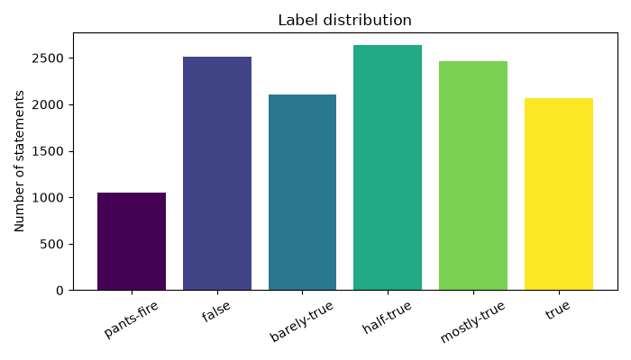
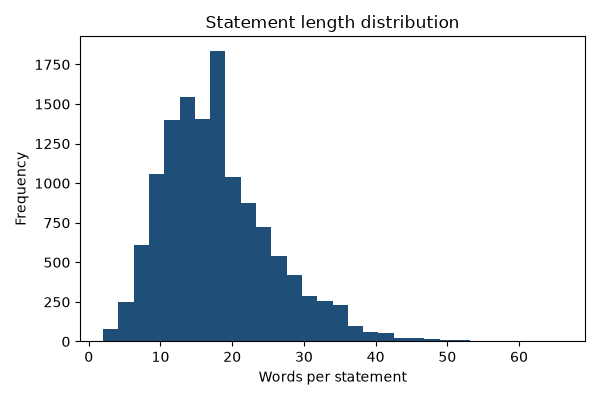
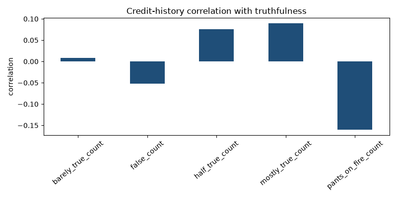
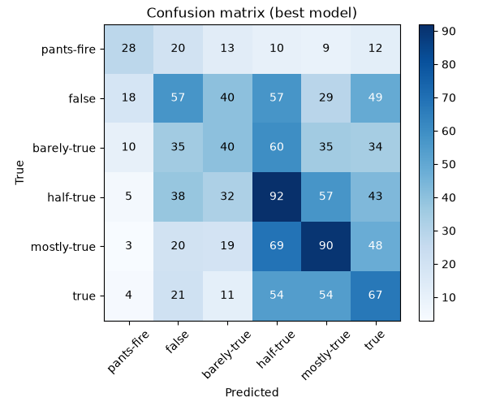
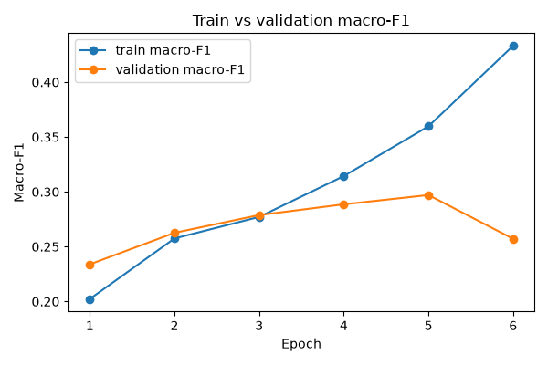

# Fake News Detection on LIAR - Project Documentation

Course: *Introduction to Deep Learning, Summer Semester 2025-2026*
Topic (project 9): **Разпознаване на фалшиви новини** - classifying a *statement*
by its truthfulness, exposed through a web application.

---

## 1. The idea of the project

Given a short political **statement**, the system predicts how truthful it is.
We follow the [LIAR benchmark](https://github.com/tfs4/liar_dataset) (Wang, ACL
2017) and support two framings of the same problem:

- **six-class** - the full PolitiFact truth scale
  `pants-fire < false < barely-true < half-true < mostly-true < true`;
- **binary** - a fake/real collapse (`pants-fire/false/barely-true → fake`,
  `half-true/mostly-true/true → real`).

The whole modelling story required by the course is told once per task:

1. **Baseline** - majority-class predictor; every later model is measured
   against it.
2. **Embedding experiments** - TF-IDF, a learned `Embedding` layer, Word2Vec,
   GloVe and FastText (step 3).
3. **Recurrent architectures** - LSTM and GRU variants, uni- and bidirectional
   (step 4).
4. **Transformer architectures** - BERT, RoBERTa, DistilBERT and GPT-2
   fine-tuning (step 5, opt-in).
5. **Web application** - a Streamlit UI that classifies any statement typed by
   the user (step 6).

Each trained model becomes one row of the Excel **Model Report File** with its
metrics and the percentage change versus the baseline.

## 2. The data (step 2 - exploration)

- **Dataset**: LIAR - 12,836 human-labelled short statements from PolitiFact,
  shipped already split into `train.tsv` (10,269), `valid.tsv` (1,284) and
  `test.tsv` (1,283). We keep the official split.
- **Features (14 raw TSV columns)**: id, label, **statement** (the text we
  model), subject(s), speaker, speaker job, state, party, five credit-history
  counts (`barely true / false / half true / mostly true / pants on fire`) and
  context (venue). We derive `label_six`, `label_binary` and a `meta_text`
  field that concatenates the metadata.
- **Label distribution** is fairly balanced for a 6-way task (no class
  collapses): half-true (2,638) and false (2,511) are the largest, pants-fire
  (1,050) the smallest; the binary collapse is 5,669 fake / 7,167 real.
- **Statement length**: mean ≈ 17.9 words, median 17, range 2-66 - these are
  one-sentence claims, not articles, which is why the task is hard.
- **Anomalies / quality**: no empty statements; 129 rows miss the `context`
  field; 26 duplicate statements; speaker is always present.
- **Statistical dependencies**: the per-speaker credit-history counts correlate
  only weakly with truthfulness (e.g. `pants_on_fire_count` ≈ -0.16 with the
  binary label), confirming Wang's finding that **metadata helps a little but
  the text is the main signal**. Republican (5,687) and Democrat (4,150) are the
  dominant parties; economy, health-care and taxes are the top subjects.

Figures produced by `experiments/exp_00_explore.py` (under
`reports/figures/eda/`):





**Why LIAR is hard.** Single short sentences carry little surface signal, the
six classes are adjacent points on a subjective scale, and the gold labels come
from human fact-checkers using external evidence the model never sees. The
literature accordingly reports ~0.20-0.27 six-class and ~0.60-0.65 binary
accuracy; our scores live in the same regime, which is the honest expectation
for this benchmark.

## 3. Word-embedding techniques (step 3)

| Technique | How it is realised |
| --------- | ------------------ |
| TF-IDF | `TfidfVectorizer` (1-2 grams) + logistic regression (`tfidf_classifier.py`) |
| Learned `Embedding` | `nn.Embedding` trained end-to-end inside the RNN |
| Word2Vec | trained on the LIAR statements with `gensim.Word2Vec` |
| FastText | trained on the LIAR statements with `gensim.FastText` (sub-word) |
| GloVe | loaded from `glove.6B.100d.txt` if present, else deterministic stand-in |
| BERT / RoBERTa / DistilBERT | contextual embeddings via fine-tuning (step 5) |

Word2Vec/FastText are **trained on the corpus itself** so the experiment is
genuine and needs no multi-GB download; GloVe loads real vectors when the file
is dropped under `data/raw/` and otherwise falls back to reproducible stand-in
vectors so the pipeline always runs.

## 4. Recurrent architectures (step 4)

`models/rnn_classifier.py` is one configurable module covering both gates:


Variants run by `run.py`: LSTM, GRU, BiLSTM + dropout, BiGRU + dropout, and a
wider & deeper BiLSTM with AdamW weight decay. Because statements are short and
right-padded, the network **mean-pools the RNN outputs over the non-padding
positions** instead of reading the final (padded) step.

## 5. Transformer architectures (step 5)

`models/transformer_classifier.py` fine-tunes any HuggingFace
`AutoModelForSequenceClassification`: **BERT** (`bert-base-uncased`), **RoBERTa**
(`roberta-base`), **DistilBERT** (`distilbert-base-uncased`) and **GPT-2**
(`gpt2`, with a pad token added). They are opt-in via `python run.py
--transformers` (or `experiments/exp_04_transformers.py`) because they download
pretrained weights and are the slowest step; defaults use small subsets/epochs.

## 6. The web application (step 6)

`app/streamlit_app.py` is a Streamlit UI: pick the task, type or pick a
statement, press **Classify**, and see the predicted label, a plain-language
explanation, the confidence and a probability bar chart. It loads the best model
saved by `run.py` (`reports/artifacts/best_model_<task>.pt`) and falls back to a
TF-IDF classifier when no artifact is present, so it always works.

```bash
streamlit run app/streamlit_app.py
```

The app's pure logic (`app_support.py`, `inference.py`) is unit-tested in the
exercise style.

## 7. Code structure

```
deep_learning_project/
  run.py                       entry point (--task six|binary [--transformers])
  app/streamlit_app.py         Streamlit web UI
  src/fake_news/
    config.py                  dataclass hyperparameters, label maps
    main.py                    end-to-end pipeline orchestration
    inference.py               save/load best model, PredictionService
    app_support.py             pure helpers for the UI
    data/
      preprocessing.py         clean_text, tokenize, Vocabulary
      dataset.py               LIAR loader, synthetic fallback, Dataset
      embeddings.py            TF-IDF/Word2Vec/GloVe/FastText vectors
    models/
      baseline.py              MajorityClassClassifier
      rnn_classifier.py        configurable (Bi)LSTM / (Bi)GRU
      tfidf_classifier.py      TF-IDF + logistic regression
      transformer_classifier.py BERT/RoBERTa/DistilBERT/GPT-2 fine-tuning
    training/
      metrics.py               accuracy / macro precision-recall-F1 / confusion
      trainer.py               train-val loop, early stopping, history
    reporting/
      report_card.py           coloured Excel Model Report File
      plots.py                 matplotlib figures
      ledger.py                JSON-lines persistence for experiment rows
  experiments/                 exp_00 exploration .. exp_04 transformers
  tests/                       BDD unit tests (one module per class)
  reports/                     model_report_<task>.xlsx + figures/ + artifacts/
  docs/                        this file + presentation outline
```

## 8. The Model Report File

`reports/model_report_<task>.xlsx` follows the course rules: one row per
experiment in creation order; hyperparameter columns first, then **Accuracy /
Macro Precision / Macro Recall / Macro F1** each with the percentage change
versus the baseline, then a `Comments` column; the baseline is the first row;
the best model (highest macro-F1) is highlighted; a `Diagrams` sheet holds the
train-vs-validation macro-F1 and loss curves; a `Best Model Examples` sheet
lists correct and incorrect predictions.

### Results (latest run on the real LIAR test set)

**Six-class** (`model_report_six.xlsx`) - main metric macro-F1:

| Model | Accuracy | Macro F1 |
| ----- | -------- | -------- |
| Baseline (majority class) | 0.21 | 0.057 |
| TF-IDF + Logistic Regression | 0.25 | 0.229 |
| LSTM (learned embedding) | 0.25 | 0.229 |
| GRU (learned embedding) | 0.24 | 0.227 |
| BiLSTM + dropout | 0.24 | 0.222 |
| BiGRU + dropout | 0.24 | 0.220 |
| Wider & deeper BiLSTM | 0.23 | 0.202 |
| BiLSTM + Word2Vec | 0.25 | 0.237 |
| BiLSTM + GloVe (stand-in) | 0.24 | 0.217 |
| **BiLSTM + FastText (best)** | **0.25** | **0.242** |

**Binary** (`model_report_binary.xlsx`):

| Model | Accuracy | Macro F1 |
| ----- | -------- | -------- |
| Baseline (majority class) | 0.57 | 0.362 |
| **TF-IDF + Logistic Regression (best)** | **0.63** | **0.609** |
| LSTM (learned embedding) | 0.61 | 0.592 |
| GRU (learned embedding) | 0.62 | 0.600 |
| BiLSTM + dropout | 0.60 | 0.602 |
| BiGRU + dropout | 0.62 | 0.603 |
| Wider & deeper BiLSTM | 0.62 | 0.586 |
| BiLSTM + Word2Vec | 0.60 | 0.596 |
| BiLSTM + GloVe (stand-in) | 0.60 | 0.589 |
| BiLSTM + FastText | 0.60 | 0.577 |

Scores are modest by design - LIAR is a hard benchmark - and the report frames
this honestly. Every neural model beats the majority-class baseline by a wide
margin on macro-F1; **TF-IDF is a remarkably strong, cheap reference** (it wins
the binary task); FastText sub-word vectors give the best six-class macro-F1;
and **extra RNN capacity yields diminishing returns** on such short inputs (the
wider/deeper BiLSTM is not the winner). "Bigger is not always better" is itself
a result worth reporting. The transformer rows (opt-in) typically close the gap
but cost far more to train.




## 9. Testing approach (step 6)

Behaviour-driven naming `test_when_<condition>_then_<expectation>`: one test
module per source class, one test class per method/function. The suite covers
preprocessing, the LIAR loader, embeddings, the RNN and TF-IDF models, the
trainer, the multi-class metrics, the report card, the ledger, the plots, the
inference service, the Streamlit helpers and the end-to-end pipeline, reaching
**100% statement coverage** of the `src` package.

```bash
coverage run -m pytest
coverage report -m
```

## 10. Limitations and future work

- **English only**; single short sentences; no external evidence, so the model
  judges language only and cannot truly fact-check.
- The six-class scale is subjective and adjacent classes overlap.

Future work (slide bullets): use the speaker/party/credit-history metadata
jointly with the text; claim-evidence retrieval and fact verification; ordinal
losses that respect the truth ordering; calibration and explainability.
